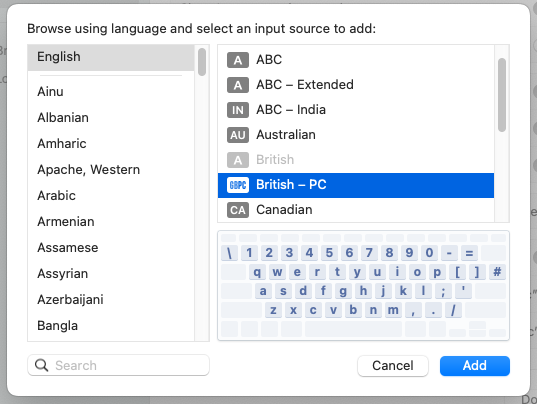
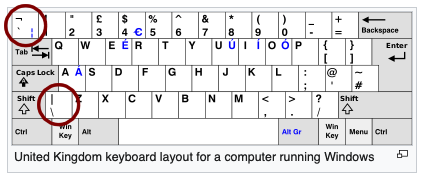
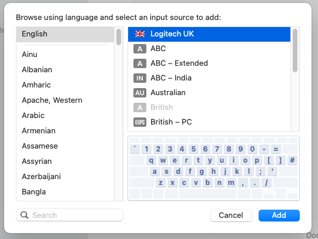

# Custom keyboard layouts

This directory aims to be a collection of custom keyboard layouts for users of external keyboards for which macOS doesn't provide an appropriate 
out-of-the-box layout.

For example, I own a Logitech MK710 with a UK key layout. To use an external UK keyboard such as this Logitech set with my company-issued MBP, normally it would be enough to just [follow Apple's instructions](https://support.apple.com/en-gb/guide/mac-help/mchlp1406/mac) and add the "British - PC" keyboard layout:



However, said layout compared to the Logitech UK layout (which appears to be the [canonical UK layout](https://en.wikipedia.org/wiki/British_and_American_keyboards)), differs in the "backtick" / "backquote" '`' and backslash '\' characters, whereby their keys are swapped. This is what we see on the Logitech keyboard:



In order to resolve this issue, I used [Ukelele](https://software.sil.org/ukelele/) to create a custom keyboard layout bundle that fixes this inconsistency. It can be downloaded an installed following the instructions below on the Terminal:

```shell
# Download the zipped bundle
curl --output-dir /var/tmp/ -LJO https://github.com/AlexGidarakos/new-to-mac-os/raw/master/files/Logitech-UK.bundle.zip

# Unzip bundle contents to system directory containing layouts
sudo unzip /var/tmp/Logitech_UK.bundle -x "__MACOSX*" -d /Library/Keyboard\ Layouts/
```

You then [follow Apple's instructions](https://support.apple.com/en-gb/guide/mac-help/mchlp1406/mac) and you should be seeing a new entry called "Logitech UK" in the list of available layouts:



If it's not visible, restart the system and retry.
