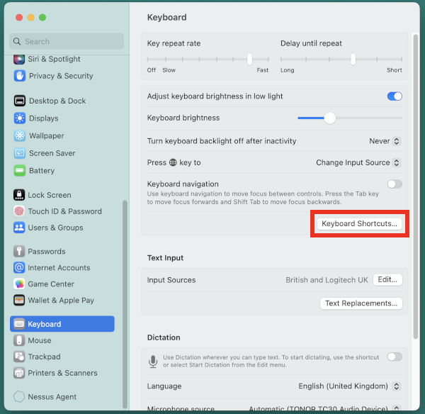
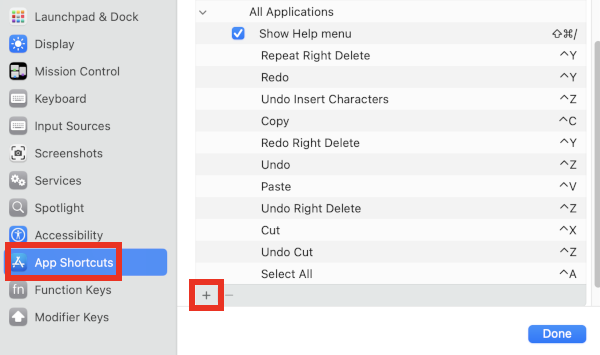
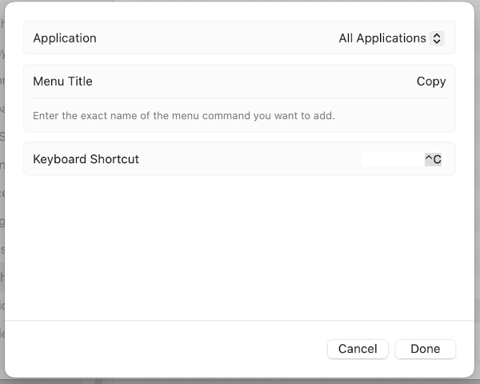

# Emulate Windows shortcuts

If muscle memory gets in your way when trying to use working shortcuts for actions such as Cut, Copy, Paste, then you can configure the macOS shortcuts to be similar to the Windows shortcuts. This is not as radical a change as [swapping modifier keys](https://support.apple.com/en-gb/guide/mac-help/mchlp1011/mac); instead you add only as many specific shortcuts as you want.

First open "Apple menu > System Settings... > Keyboard > Keyboard Shortcuts...":

Click "App Shortcuts", then the "Plus" icon:

In the field "Menu Title", you must enter the exact action that appears in the Edit menu of the application:

Most applications use the generic "Cut", "Copy", "Paste", "Undo", "Redo", "Select All" etc. action names, however there are some applications such as Sublime Text that add qualifiers like "Undo Right Delete". Once you enter the "Menu Title", click in the input field next to "Keyboard Shortcut" and type your desired shortcut, then click "Done". Repeat for additional shortcuts.
